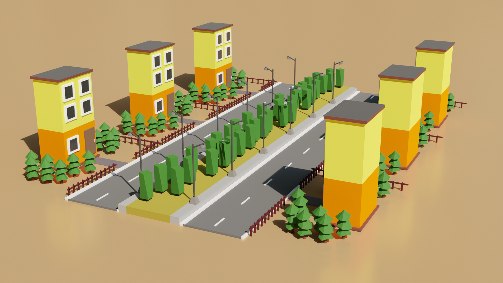
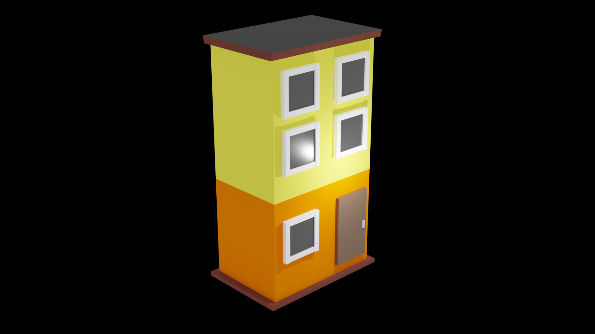
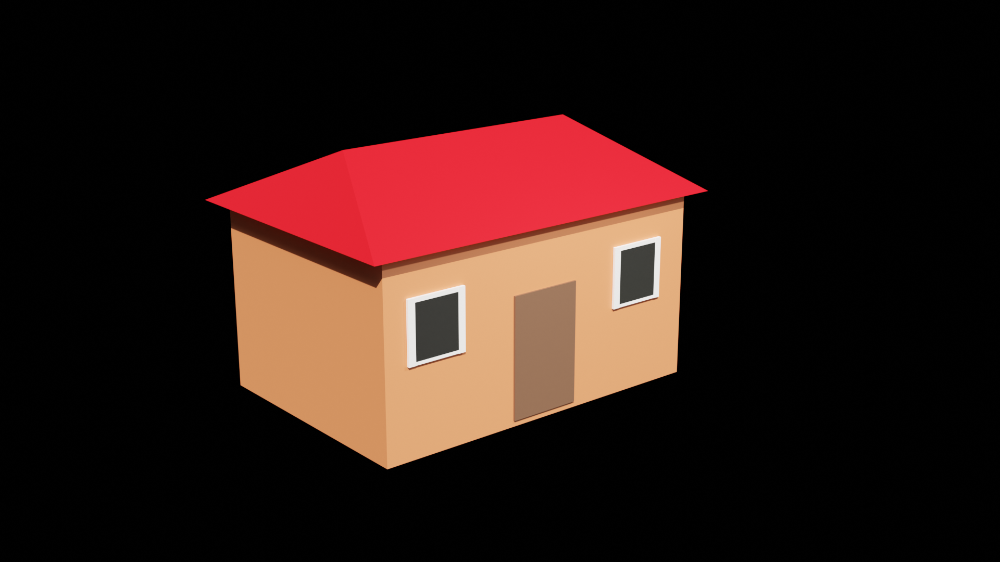
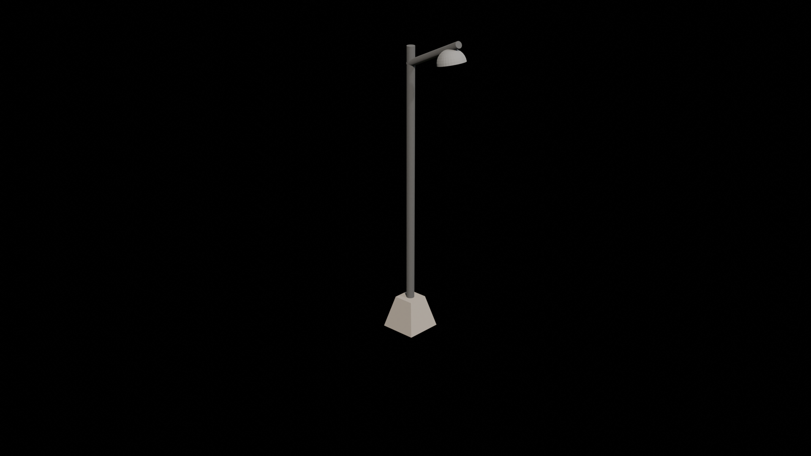
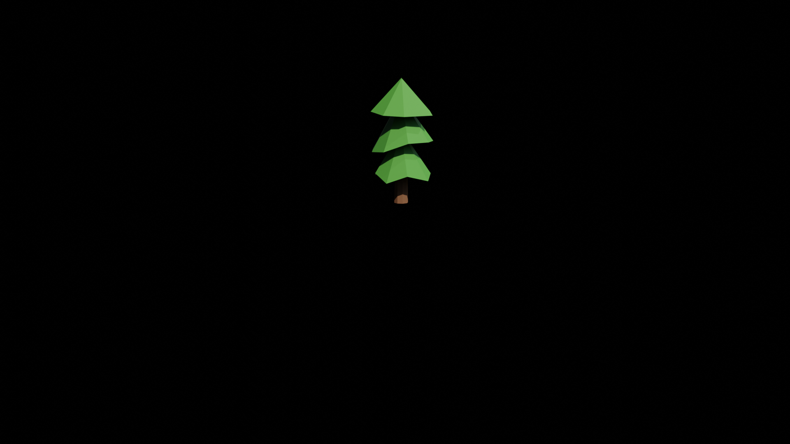

# ank-world-assets
This repository consists all the assets for ank world. All these assets are created using blender.

# Screenshots

# License
This project is licensed under MIT. Feel free to use it in any way you want.